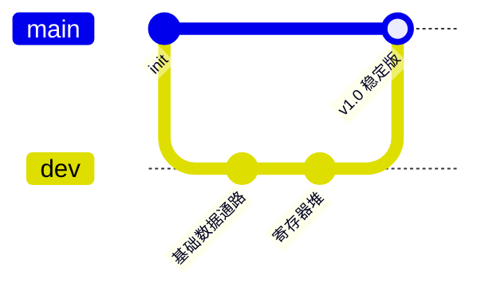
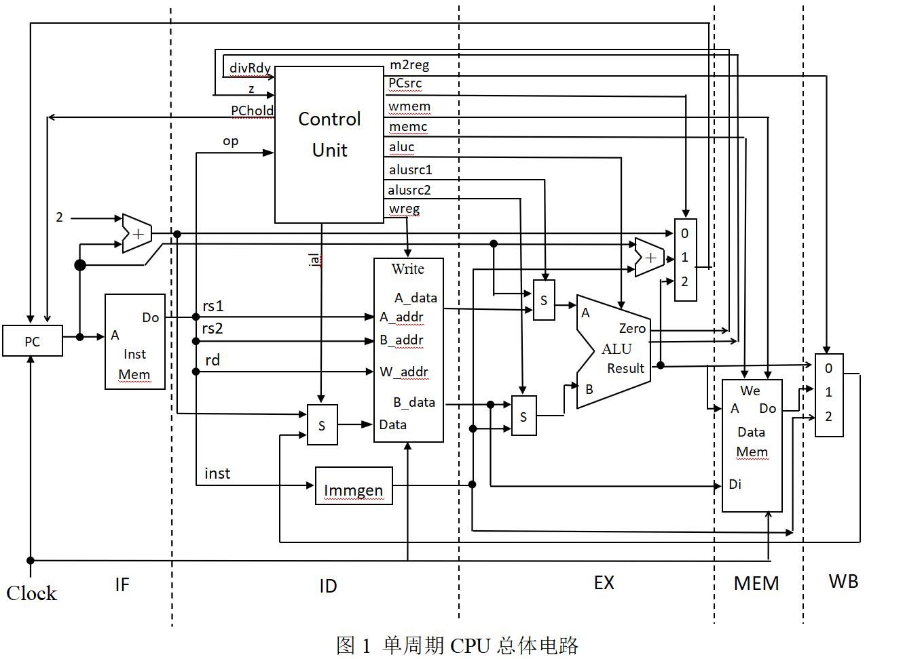
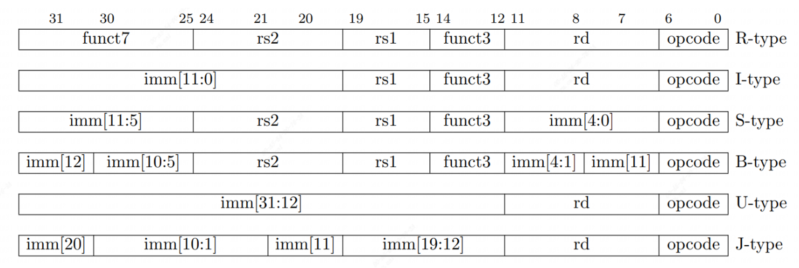
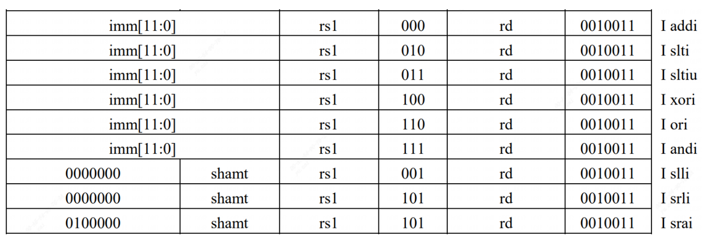
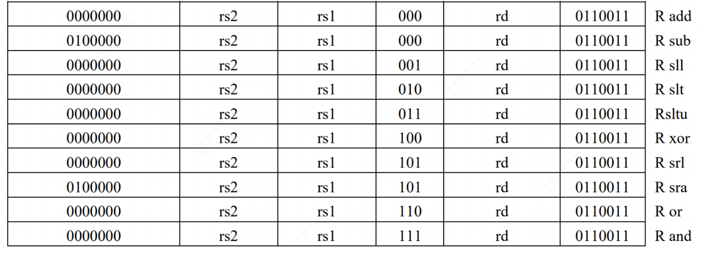
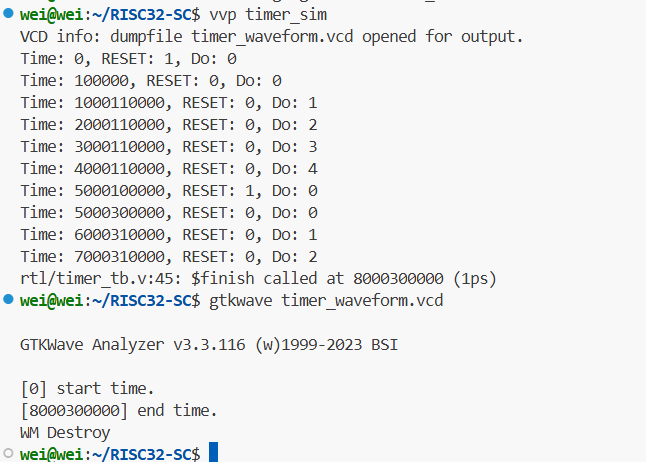

# RISC32-SC


## 项目简介

RISC32-SC 是一个基于 **自定义指令集架构（ISA）** 的 **32 位 RISC 单周期 CPU** 硬件设计与实现项目。  
本项目从指令集设计、数据通路构建到控制逻辑实现，完整展示了一个处理器从理论到硬件的实现过程。  


### 项目特性

- **自定义 ISA**：包含算术、逻辑、存储访问与分支跳转等基础指令  
- **单周期设计**：每条指令在一个时钟周期内完成执行  
- **模块化实现**：数据通路、控制单元、寄存器堆、存储器等独立设计，便于扩展  
- **可仿真与验证**：支持在仿真工具中运行测试程序，验证指令正确性  
- **可综合部署**：设计可在 FPGA 上实现  


### 项目结构

.
 ├── doc/          # 文档（ISA 说明、设计思路、时序图等）
 ├── rtl/          # Verilog 源码
 ├── sim/          # 仿真代码与测试用例
 ├── fpga/         # 针对 FPGA 平台的综合与部署文件
 ├── images/         # 项目说明所需要的图片
 └── README.md     # 项目说明


### 快速开始

1. 克隆仓库

```bash
git clone https://github.com/xuan361/RISC32-SC.git
```

1. 打开 `sim/` 文件夹，在仿真工具（Vivado Simulator）中运行测试
2. 查看 `doc/` 目录下的 ISA 规范与数据通路设计说明


### 开发环境

- **硬件描述语言**：Verilog HDL
- **仿真工具**： Vivado
- **目标 FPGA 平台**：Xilinx / Intel FPGA（可选）


### 开发流程




### RISC-V 指令集特性

#### 核心特点

RISC-V 是一个基于精简指令集计算（RISC）原则的开源指令集架构（ISA）。

- **开源免费**: 无需支付专利费用即可自由使用。
- **模块化设计**: 拥有固定的基础指令集（如RV32I），并可通过标准扩展（如M、A、F、D等）增加功能。
- **可扩展性**: 支持用户自定义指令，适用于特定领域加速。

#### 实现的指令集

本项目CPU核心基于 **RV32IM** 指令集：

- **RV32I**: 基础的32位整数指令集。本项目实现了除ECALL/EBREAK、FENCE及CSR指令外的37条指令。
- **RV32M**: 整数乘法和除法标准扩展指令。


## 总设计图



## 状态机

```verilog
    localparam S_WAIT_COUNT    = 4'b0001; // 等待接收指令总数的低字节 1
    localparam S_WAIT_COUNT_MSB    = 4'b0010; // 等待接收指令总数的高字节 2
    localparam S_LOADING_INSTR_LSB = 4'b0011; // 等待接收指令的低字节 3
    localparam S_LOADING_INSTR_MSB = 4'b0100; // 等待接收指令的高字节 4
    localparam S_LOAD_DONE         = 4'b0101; // 加载完成，等待启动 5
    localparam S_RUNNING           = 4'b0110; // CPU运行 6
	localparam S_WAIT_DATA         = 4'b0111; // 等待传输数据 7
```


## 功能部件

### 指令寄存器

- 输入：A

- 输出：op, rd, rs1, rs2, instruction

所有指令长度为32位，采用小端模式存储。主要格式如下：



```
opcode(操作码)：指令的基本操作，这个缩写是它惯用名称。
rd：目的操作寄存器，用来存放操作结果。
funct3：一个另外的操作码字段。
rs1：第一个源操作数寄存器。
rs2：第二个源操作数寄存器。
funct7：一个另外的操作码字段。
imm：立即数
```


### PC

- 输入： CLK, RESET, PCHold,  newAddress, 
- 输出： currentAddress


### immGen




```verilog
ADDI rd, rs1, imm: 将寄存器rs1中的值加上立即数imm，结果存储在rd。立即数imm是12位，其中最高位是符号位。如果imm[11]为1，则需要进行符号扩展，将imm扩展到32位。
ANDI rd, rs1, imm: 寄存器rs1和立即数imm按位与，结果存储在rd。imm也是12位，并遵循同样的符号扩展规则。
ORI rd, rs1, imm: 寄存器rs1和立即数imm按位或，结果存储在rd。立即数imm同样为12位，且根据最高位决定是否进行符号扩展。
XORI rd, rs1, imm: 寄存器rs1和立即数imm按位异或，结果存储在rd。立即数imm的处理方式相同。
SLLI rd, rs1, shamt: 寄存器rs1左移shamt位（逻辑左移），结果存储在rd。shamt是立即数但仅使用低5位（对于RV32I）。
SLTI rd, rs1, imm: 如果rs1小于立即数imm（有符号比较），则rd设置为1，否则设置为0。imm为12位并可能需要符号扩展。
SLTIU rd, rs1, imm: 如果rs1小于立即数imm（无符号比较），则rd设置为1，否则设置为0。imm的处理方式同上。
SRLI/SRAI rd, rs1, shamt: 寄存器rs1右移shamt位（逻辑/算术右移），结果存储在rd。shamt是立即数但仅使用低5位（对于RV32I）。SRAI会考虑符号位进行扩展，而SRLI不会。
```


### ALU

**R型指令包括加法、减法、逻辑运算、移位运算**



```verilog
ADD rd, rs1, rs2: 将寄存器rs1和rs2中的值相加，结果存储在rd。
SUB rd, rs1, rs2: 从寄存器rs1中减去寄存器rs2的值，结果存储在rd。
AND rd, rs1, rs2: 寄存器rs1和rs2按位与，结果存储在rd。
OR rd, rs1, rs2: 寄存器rs1和rs2按位或，结果存储在rd。
XOR rd, rs1, rs2: 寄存器rs1和rs2按位异或，结果存储在rd。
SLL rd, rs1, rs2: 寄存器rs1左移rs2位（逻辑左移），结果存储在rd。
SLT rd, rs1, rs2: 如果rs1小于rs2（有符号比较），则rd设置为1，否则设置为0。
SLTU rd, rs1, rs2: 如果rs1小于rs2（无符号比较），则rd设置为1，否则设置为0。
SRL rd, rs1, rs2: 寄存器rs1右移rs2位（逻辑右移），结果存储在rd。
SRA rd, rs1, rs2: 寄存器rs1右移rs2位（算术右移），结果存储在rd。
```

| 指令类型 | 输入是否取绝对值     | 输出修正              |
| -------- | -------------------- | --------------------- |
| `DIV`    | 两数取绝对值参与除法 | 商取符号（rs1 ^ rs2） |
| `DIVU`   | 不取绝对值           | 商直接输出            |
| `REM`    | 两数取绝对值参与除法 | 余数取符号（rs1）     |
| `REMU`   | 不取绝对值           | 余数直接输出          |

### RegisterFile 寄存器组

- **32个通用寄存器 (x0-x31)**: 每个寄存器宽度为32位。

```
x0 (zero) ：硬连线为常数0，任何写入此寄存器的操作都会被忽略。
x1 (ra) ： 保存返回地址，用于函数调用后返回
x2 (sp) ： 栈指针，指向当前栈顶。
x3 (gp) ： 全局指针，用于访问全局数据区。
x4 (tp) ： 线程指针，可用于多线程环境下的线程本地存储。
x5-x7 (t0-t2) - 临时寄存器，可以由调用者自由使用。
x8-x9 (s0-s1, fp) - 已保存寄存器/帧指针，需要由调用者保存和恢复。
x10-x11 (a0-a1) - 函数参数/返回值，用于传递前两个整型或指针参数。
x12-x17 (a2-a7) - 函数参数，用于传递更多的参数。
x18-x27 (s2-s11) - 已保存寄存器，需要由调用者保存和恢复。
x28-x31 (t3-t6) - 临时寄存器，可以由调用者自由使用。
```

### DataMemory

​	**小端模式**：传入的数据低位要放在索引值小的存储单元里

- 内存：1字节为单位
- 寄存器：4字节为单位


## 指令列表

#### RV32I 基础指令集

- **R-type**
  - `add`, `sub`, `sll`, `slt`, `sltu`, `xor`, `srl`, `sra`, `or`, `and`
- **I-type (立即数运算)**
  - `addi`, `slti`, `sltiu`, `xori`, `ori`, `andi`, `slli`, `srli`, `srai`
- **I-type (Load)**
  - `lb`, `lh`, `lw`, `lbu`, `lhu`
- **S-type (Store)**
  - `sb`, `sh`, `sw`
- **B-type (条件跳转)**
  - `beq`, `bne`, `blt`, `bge`, `bltu`, `bgeu`
- **U-type**
  - `lui`, `auipc`
- **J-type & I-type (无条件跳转)**
  - `jal`, `jalr`

#### RV32M 扩展指令集

**R-type**

- `mul`: 乘法，取结果低32位。
- `mulh`: 有符号乘法，取结果高32位。
- `mulhsu`: 有符号与无符号数相乘，取结果高32位。
- `mulhu`: 无符号乘法，取结果高32位。
- `div`: 有符号除法。
- `divu`: 无符号除法。
- `rem`: 有符号取余。
- `remu`: 无符号取余。

## 仿真测试

### 工作时间计数器




## 硬件系统设计

### 单周期CPU核心

CPU被设计为一个单周期处理器，即一条指令在一个时钟周期内执行完毕。

> **注意**: M扩展中的除法指令 (`div`, `divu`, `rem`, `remu`) 是一个例外。由于除法运算的复杂性，它需要多个周期。在执行除法指令时，控制单元会发出`PChold`信号暂停PC更新，直到ALU中的除法器完成计算并发出`divRdy`信号。

### SoC系统架构

CPU核心通过一条 **RISC-V内部总线 (RIB)** 与多个外设连接，形成一个完整的SoC系统。存储器和外设采用统一编址。

- **RIB总线信号**:
  - **地址总线 (Address Bus)**: 传输CPU访问的地址。
  - **数据总线 (Data Bus)**: 双向传输读写数据。
  - **控制信号 (wr_en)**: 写使能信号。

#### 地址空间分配

本项目设计的SoC共挂载5个外设，每个外设空间大小为256MB。

| 起始地址      | 设备  | 大小  |
| ------------- | ----- | ----- |
| `0x4000_0000` | GPIO  | 256MB |
| `0x3000_0000` | UART  | 256MB |
| `0x2000_0000` | Timer | 256MB |
| `0x1000_0000` | RAM   | 256MB |
| `0x0000_0000` | ROM   | 256MB |

### 系统组件详解

#### 1. 控制单元 (Control Unit)

- **功能**: 根据指令的`opcode`字段生成CPU内部所有模块的控制信号。
- **输入**:
  - `op`: 来自指令的7位操作码。
  - `divRdy`: 来自ALU的除法完成信号。
- **输出**:
  - `PChold`: PC保持信号，用于多周期除法。
  - `PCsrc`: PC更新来源选择信号。
  - `wmem`: 数据存储器写使能。
  - `memc`: 访存控制相关信号。
  - `aluc`: ALU操作选择信号。
  - `alusrc`: ALU第二操作数来源选择信号。
  - `wreg`: 寄存器堆写使能。

#### 2. 算术逻辑单元 (ALU)

- **功能**: 执行算术和逻辑运算，包括加减、移位、逻辑与/或/异或、比较以及乘除法。
- **输入**:
  - `A`: 来自`rs1`寄存器的数据。
  - `B`: 来自`rs2`寄存器或立即数生成器的数据。
  - `aluc`: 来自控制单元的操作选择信号。
- **输出**:
  - `Result`: 32位运算结果。
  - `Zero`: 零标志位，用于B-type指令判断。
  - `divRdy`: 除法完成信号 (仅M扩展)。

#### 3. Timer

- **功能**: 提供一个32位的计数器，用于计时。
- **寄存器**:
  - **地址偏移 `0x0`**: 32位计数器，计数单位为毫秒。

#### 4. GPIO (通用输入/输出)

- **功能**: 控制LED灯组和数码管组的显示。
- **寄存器**:
  - **地址偏移 `0x0`**: 8位LED灯组控制寄存器，每位对应一个LED灯。
  - **地址偏移 `0x1` ~ `0x7`**: 6个数码管的控制寄存器，每个寄存器8位宽。

#### 5. UART (通用异步收发器)

**功能**: 实现串行通信。

**寄存器**: 

| 偏移地址 | 寄存器名称    | 功能描述                                                     |
| -------- | ------------- | ------------------------------------------------------------ |
| `0x00`   | `UART_CTRL`   | 控制寄存器。bit0: 发送使能; bit1: 接收使能。                 |
| `0x04`   | `UART_STATUS` | 状态寄存器。bit0: 发送忙标志 (1为忙); bit1: 接收完成标志 (1为完成)。 |
| `0x08`   | `UART_BAUD`   | 波特率设置寄存器。                                           |
| `0x0c`   | `UART_TXDATA` | 发送数据寄存器。                                             |
| `0x10`   | `UART_RXDATA` | 接收数据寄存器。                                             |

​                                                                                                                           

## 软件与验证

- **工具链**: 使用 **GNU RISC-V32 GCC** 编译开发工具进行C语言和汇编程序的开发。
- **验证程序**: 编写了三个示例程序来验证SoC系统的完整功能：
  1. **流水LED灯**: 验证GPIO的写操作功能。
  2. **时钟显示**: 验证Timer的读操作和GPIO数码管的写操作功能。
  3. **使用UART显示字符串**: 验证UART的发送功能。


## Question

-  可以用用 **SystemVerilog**语言吗
-  jal和jalr的可能扩展是什么意思？
-  


## TODO

- 完善uart


## 参考

|       主题       |                             链接                             |
| :--------------: | :----------------------------------------------------------: |
| 关于流水线的优势 | https://blog.csdn.net/weixin_75067193/article/details/133852299 |
|                  |                                                              |
|                  |                                                              |

##  Idea

> 如果一个模块的最终输出 (`Result`)，在不同情况下依赖于时序逻辑和组合逻辑的结果，应该怎么处理？

### 解决方案：使用组合逻辑 MUX 统一输出

如果一个模块的最终输出 (`Result`) 必须在不同情况下（由控制信号 `aluc` 或状态信号 `divReady` 决定）依赖于：

1. **组合逻辑结果** (Single-Cycle Operations: ADD, MUL, etc.)：结果必须在当前周期**立即**产生。
2. **时序逻辑结果** (Multi-Cycle Operations: DIV/REM)：结果必须在完成后的**时钟沿**更新，并在接下来的周期**保持**。

最标准的硬件处理方法是：**将最终输出定义为一个组合逻辑信号 (wire)，并使用多路选择器 (MUX) 来选择正确的源**。

**关键步骤和设计原则**

以下是我们采用的、也是最推荐的解决方案，通过引入一个 **专用的时序寄存器** 来解决数据保持问题：

#### 1. 将输出 `Result` 视为一个 MUX 的输出

在最终的代码中，我们不再让 **`Result`** 寄存器同时承担单周期和多周期任务。我们让 `Result` 保持 `reg` 类型（为了满足您的端口定义），但实际上，我们让 **组合逻辑块 (`always @(*)`)** 负责 MUX 的选择和赋值。

### 2. 定义两个数据源

- **`single_cycle_result` (Reg/Wire)**：用于计算和存储所有单周期操作（ADD、MUL、逻辑运算等）的 **即时组合逻辑结果**。它在组合逻辑块中被赋值。
- **`div_result_reg` (Reg)**：**专用的时序寄存器**，仅用于在除法完成后，在时钟上升沿**锁存**商或余数，并在后续周期保持该值。它在时序逻辑块中被赋值。

### 3. MUX 逻辑 (`always @(*)`)

在组合逻辑块中，我们根据当前的控制码 `aluc` 来决定最终输出 `Result` 应该是什么：

| 指令类型 (由 `aluc` 决定)                    | 行为                                     | 最终输出 `Result` 的源    |
| -------------------------------------------- | ---------------------------------------- | ------------------------- |
| **单周期指令** (ADD, MUL, SLL, Branching...) | 结果必须立即生效。                       | **`single_cycle_result`** |
| **多周期指令** (DIV, REM)                    | 结果在完成时已更新并锁存在内部寄存器中。 | **`div_result_reg`**      |

通过这种方式，我们避免了在一个 `reg` 上同时使用阻塞赋值 (`=`) 和非阻塞赋值 (`<=`) 的不良实践，并确保了单周期指令结果的**零延迟**输出。

### 4. 统一的时序控制

**时序逻辑块 (`always @(posedge CLK)`)** 的职责被简化为仅控制 **状态** 和 **寄存器更新**：

- 控制多周期状态机 (`div_count`, `divReady`) 的转移。
- 在除法完成时，将最终结果 **非阻塞赋值 (`<=`)** 给 **`div_result_reg`**。
- 控制所有其他内部状态寄存器（`dividend`, `divisor`, `div_temp`）。

这个 **"计算在组合逻辑，保持在时序逻辑，选择也在组合逻辑"** 的模式是高性能数字设计中处理多功能单元输出的标准方法。


